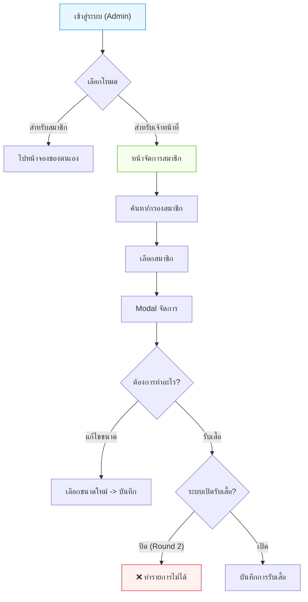

# คู่มือการใช้งานสำหรับเจ้าหน้าที่ (รอบ 2)

เอกสารนี้อธิบายขั้นตอนการใช้งานระบบสำหรับ **เจ้าหน้าที่ (Admin)** ในช่วงเปิดจองรอบ 2

## 1. การเข้าสู่ระบบ (Login)
1.  ใช้ข้อมูลสมาชิกของเจ้าหน้าที่ในการ Login
2.  เมื่อ Login สำเร็จ จะมีหน้าต่าง (Modal) ให้เลือก:
    - ปุ่ม **"สำหรับเจ้าหน้าที่"**: เพื่อเข้าสู่ระบบจัดการหลังบ้าน
    - ปุ่ม **"สำหรับสมาชิก"**: เพื่อเข้าสู่หน้าจองของตัวเอง

## แผนผังการทำงาน (Flowchart)

## 2. หน้าจัดการสมาชิก (Member List)
- **ค้นหา**: พิมพ์ ชื่อ, เลขสมาชิก, หรือเบอร์โทร ในช่องค้นหา
- **ตัวกรอง (Filter)**:
    - **สถานะการรับ**: เลือกดูเฉพาะคนที่ "รับแล้ว" หรือ "ยังไม่รับ"
    - **รอบ**: เลือกดูเฉพาะ "รอบ 1" หรือ "รอบ 2"
- **ตารางข้อมูล**: แสดงรายชื่อสมาชิก สถานะการจอง และสถานะการรับเสื้อ

## 3. การจัดการรายบุคคล (Pickup Modal)
คลิกที่ชื่อสมาชิกในตารางเพื่อเปิดหน้าต่างจัดการ:

### 3.1 ข้อมูลสมาชิก
- ตรวจสอบ ชื่อ, เลขสมาชิก, ขนาดที่จอง
- สังเกต **"รอบที่"**:
    - **สีฟ้า**: สมาชิกจากรอบ 1
    - **สีส้ม**: สมาชิกจากรอบ 2

### 3.2 การแก้ไขขนาด (Edit Size)
- เจ้าหน้าที่สามารถเปลี่ยนขนาดเสื้อให้สมาชิกได้
- **วิธีเปลี่ยน**:
    1.  กดปุ่ม **"เปลี่ยนขนาด"**
    2.  เลือกขนาดใหม่ที่ต้องการ (ระบบจะแสดงจำนวนสต็อกคงเหลือจริง)
    3.  กดปุ่ม **"บันทึกขนาด"** (ปุ่มจะเป็นสีน้ำเงินเมื่อมีการเปลี่ยนแปลง)

### 3.3 การบันทึกการรับเสื้อ (Record Pickup)
> ⚠️ **หมายเหตุสำคัญ**:
> ในช่วงเปิดจองรอบ 2 **ระบบปิดฟังก์ชันการรับเสื้อชั่วคราว** เพื่อป้องกันความสับสนและจัดการสต็อก

- ปุ่ม "บันทึกการรับเสื้อ" จะเป็นสีเทาและกดไม่ได้
- ช่องเลือก "รับด้วยตนเอง" / "รับแทน" จะถูกปิดการใช้งาน
- หากต้องการเปิดใช้งาน ต้องแจ้งผู้ดูแลระบบให้เปิดการตั้งค่า `ENABLE_PICKUP`
