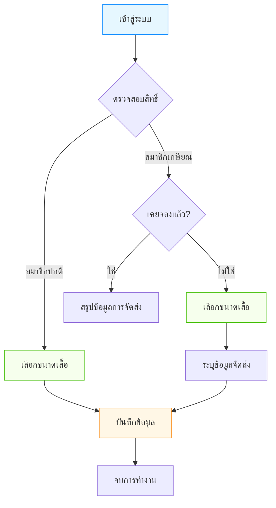

# คู่มือการใช้งานสำหรับสมาชิก (รอบ 2)

เอกสารนี้อธิบายขั้นตอนการใช้งานระบบจองเสื้อแจ็กเก็ต สอ.มก. สำหรับ **สมาชิก (Member)** ในรอบเก็บตก (Round 2)

## 1. การเข้าสู่ระบบ (Login)
- **URL**: เข้าสู่หน้าแรกของเว็บไซต์
- **ข้อมูลที่ต้องใช้**:
  1.  **เลขสมาชิก** (Member Code)
  2.  **เบอร์โทรศัพท์** (Phone Number)
  3.  **เลขบัตรประชาชน 3 ตัวท้าย** (Last 3 digits of ID Card)
- **สังเกตหน้าจอ**:
  - ต้องมีข้อความ "จองขนาดเสื้อแจ็กเก็ต สอ.มก. **(รอบที่ 2)**"
  - มีป้าย Tag สีส้มระบุว่า **"สำหรับสมาชิกที่ยังไม่จอง"**

## แผนผังการทำงาน (Flowchart)

## 2. การตรวจสอบสิทธิ์
เมื่อกด "เข้าสู่ระบบ" ระบบจะตรวจสอบสถานะของท่าน:
- **กรณีสมาชิกปกติ**: ระบบจะพาไปหน้า **เลือกขนาดเสื้อ** ทันที
- **กรณีสมาชิกเกษียณ**:
    - หากเคยจองแล้ว: ระบบจะพาไปหน้า **สรุปข้อมูลการจัดส่ง**
    - หากยังไม่จอง: ระบบจะพาไปหน้า **เลือกขนาดเสื้อ**
- **กรณีเจ้าหน้าที่ (Admin)**: จะมีหน้าต่างให้เลือกว่าจะเข้าใช้งานในฐานะ "เจ้าหน้าที่" หรือ "สมาชิก"

## 3. การเลือกขนาดเสื้อ (Size Selection)
- **เลือกขนาด**: คลิกเลือกขนาดเสื้อที่ต้องการ (S, M, L, XL, etc.)
- **ตรวจสอบสต็อก**:
  - **สีเขียว**: มีสินค้า (เช่น "เหลือ 50 ตัว") -> สามารถจองได้
  - **สีแดง**: สินค้าหมด -> ไม่สามารถเลือกได้
- **บันทึกข้อมูล**: เมื่อเลือกขนาดเสร็จแล้ว ให้กดปุ่ม **"บันทึก"**

## 4. การตรวจสอบข้อมูล
- หลังจากบันทึกสำเร็จ ระบบจะแสดงหน้าสรุปข้อมูล
- กรุณาตรวจสอบ **ขนาดที่จอง** ให้ถูกต้อง
